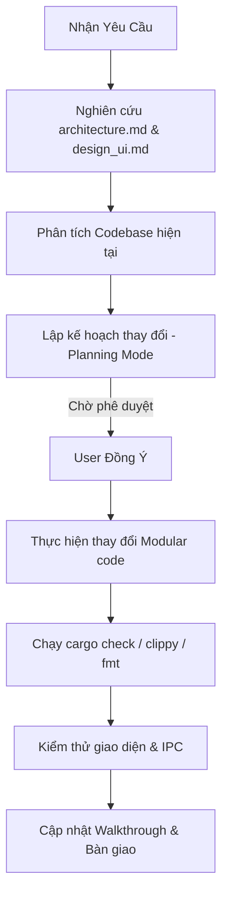

# 🤖 Agent Skill: Quy trình Phát triển NetWarp-Manager (WiWarp)

Tài liệu này đóng vai trò là **Agent Skill / Workflow** bắt buộc dành cho tất cả các AI coding agents khi làm việc trên dự án **NetWarp-Manager (WiWarp)**. Nó định hướng cách tiếp cận mã nguồn, các nguyên tắc thiết kế giao diện và quy tắc viết mã cốt lõi để đảm bảo hệ thống luôn đồng bộ, sạch sẽ và an toàn.

---

## 🛠️ BƯỚC 1: Đọc Hiểu Tài Liệu Kiến Trúc (Bắt Buộc)

Trước khi thực hiện bất kỳ thay đổi nào trong mã nguồn hoặc đề xuất giải pháp cho người dùng, Agent **BẮT BUỘC** phải đọc và phân tích hai tài liệu nền tảng sau:

1. **[architecture.md](file:///home/exblackhole/Desktop/NetWarp-Manager/architecture.md)**:
   - Nắm rõ cấu trúc **Modular Hybrid Desktop** của Tauri v2.
   - Hiểu cơ chế hoạt động của Backend (Rust Core) bao gồm các module: `main.rs`, `lib.rs`, `wifi.rs`, `warp.rs`, và `net_utils.rs`.
   - Hiểu cấu trúc Modular của Frontend trong `src/components/` và logic điều khiển trong `src/js/` (như `loader.js`, `dom.js`, `state.js`, v.v.).
   - Tuân thủ cơ chế Non-Blocking IPC, Double-Interval Polling, và mô hình bảo mật Polkit (`pkexec`).

2. **[src/design_ui.md](file:///home/exblackhole/Desktop/NetWarp-Manager/src/design_ui.md)**:
   - Tuân thủ nghiêm ngặt kích thước giao diện chuẩn **1600x900** cố định (`grid-cols-12`, `overflow-hidden`).
   - Giữ vững phong cách **Cyberpunk Glassmorphism** (`bg-slate-900/40`, `border-slate-800`, `backdrop-blur-md`).
   - Sử dụng đúng hệ màu đèn LED trạng thái (Green 🟢, Orange 🟡, Red 🔴, Gray ⚫).
   - Áp dụng chuẩn Typography: **Outfit Font** cho nhãn/tiêu đề và **JetBrains Mono** cho các ký tự số hoặc console log để đảm bảo giao diện sắc nét và trực quan.

---

## 📐 BƯỚC 2: Tuân Thủ Các Quy Tắc Viết Mã Của Dự Án

Agent phải tuân thủ tuyệt đối các nguyên tắc lập trình sau (User-defined rules):

### 1. Ngôn Ngữ Trò Chuyện & Chú Thích (Language Rules)
*   💬 **Giao tiếp với Người dùng**: Luôn sử dụng **Tiếng Việt** khi trò chuyện, giải thích giải pháp hoặc đề xuất kế hoạch lập trình với người dùng.
*   📝 **Chú thích trong Mã nguồn (Code Comments)**: Mọi dòng chú thích kỹ thuật trực tiếp trong mã nguồn (`.rs`, `.js`, `.css`, `.html`) **BẮT BUỘC phải viết bằng Tiếng Anh** để tối ưu hóa sự tương thích với các công cụ phân tích tĩnh.

### 2. Tiêu Chuẩn Rust Idiomatic
*   Mã nguồn Rust phải đảm bảo tính **idiomatic** (chuẩn mực, tối ưu và an toàn bộ nhớ).
*   Sử dụng kiểu dữ liệu `Result<T, E>` để bắt lỗi và trả lỗi trực quan về phía Frontend.
*   **Bắt buộc** phải chạy các công cụ kiểm tra chất lượng trước khi hoàn thành (chỉ áp dụng khi có chỉnh sửa mã nguồn Rust; nếu chỉ sửa đổi phần giao diện UI như HTML/JS/CSS mà không chạm vào Rust, Agent **không cần** chạy các lệnh này):
    ```bash
    cargo check
    cargo clippy
    cargo fmt
    ```
    Hãy đảm bảo mã nguồn sạch sẽ, không còn bất kỳ cảnh báo (warnings) hay lỗi định dạng nào từ Clippy.

### 3. Phân Rã Mã Nguồn (Modular Architecture)
*   **KHÔNG** viết các file mã nguồn khổng lồ hoặc dồn tất cả tính năng vào một chỗ.
*   Phải chia nhỏ mã nguồn thành các module chuyên biệt:
    - Backend: Tách biệt logic hệ thống thành các module nhỏ trong `src-tauri/src/`.
    - Frontend: Chia nhỏ giao diện thành các thành phần HTML độc lập trong `src/components/` và logic JS tương ứng trong `src/js/`.
*   Ưu tiên hàng đầu cho việc thiết kế kiến trúc rõ ràng, hợp lý, dễ bảo trì và dễ mở rộng.

---

## 📈 BƯỚC 3: Quy Trình Thực Thi Nhiệm Vụ (Step-by-Step)

Khi nhận được yêu cầu mới từ người dùng:



1.  **Nghiên cứu & Lập kế hoạch**: Thực hiện khảo sát các file mã nguồn tương ứng được liệt kê trong `architecture.md`. Lập bản Kế hoạch triển khai (`implementation_plan.md`) chi tiết trước khi tiến hành viết code.
2.  **Triển khai & Phân tách**: Tiến hành sửa đổi hoặc tạo mới các file. Nếu thêm tính năng mới, tạo thêm module Rust và file JS tương ứng, đăng ký chúng vào `lib.rs` và `loader.js`.
3.  **Kiểm tra chất lượng**: Thực thi kiểm tra cú pháp và định dạng code Rust (chỉ áp dụng khi có chỉnh sửa mã nguồn Rust; được bỏ qua hoàn toàn nếu chỉ sửa đổi phần UI).
4.  **Bàn giao**: Tạo walkthrough chi tiết và hướng dẫn người dùng kiểm thử tính năng mới.
