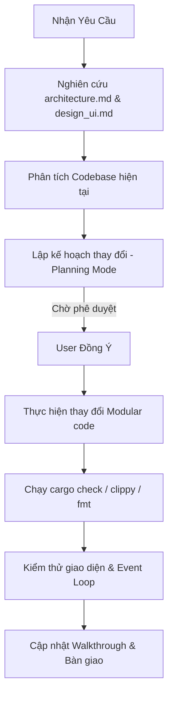

# 🤖 Agent Skill: Quy trình Phát triển NetWarp-Manager (WiWarp)

Tài liệu này đóng vai trò là **Agent Skill / Workflow** bắt buộc dành cho tất cả các AI coding agents khi làm việc trên dự án **NetWarp-Manager (WiWarp)**. Nó định hướng cách tiếp cận mã nguồn, các nguyên tắc thiết kế giao diện và quy tắc viết mã cốt lõi để đảm bảo hệ thống luôn đồng bộ, sạch sẽ và an toàn.

---

## 🛠️ BƯỚC 1: Đọc Hiểu Tài Liệu Kiến Trúc (Bắt Buộc)

Trước khi thực hiện bất kỳ thay đổi nào trong mã nguồn hoặc đề xuất giải pháp cho người dùng, Agent **BẮT BUỘC** phải đọc và phân tích tài liệu nền tảng sau:

*   **[architecture.md](file:///home/exblackhole/Desktop/NetWarp-Manager/architecture.md)**:
    - Nắm rõ cấu trúc **Single-Process Native Linux Desktop App** viết bằng **Slint UI framework** và Rust Backend Core.
    - Hiểu cơ chế hoạt động của Backend (Rust Core) bao gồm các module: `main.rs`, `helpers.rs`, `callbacks.rs`, `polling.rs`, `wifi.rs`, `warp.rs`, và `net_utils.rs`.
    - Hiểu cấu trúc mô-đun của Frontend Slint trong `src/ui/` và file giao diện chính `src/app.slint`.
    - Tuân thủ cơ chế Non-blocking Slint Event Loop, Thread-safe UI update (Weak AppWindow), Double-Interval Polling, và mô hình bảo mật Polkit (`pkexec`).

---

## 📐 BƯỚC 2: Tuân Thủ Các Quy Tắc Viết Mã Của Dự Án

Agent phải tuân thủ tuyệt đối các nguyên tắc lập trình sau (User-defined rules):

### 1. Ngôn Ngữ Trò Chuyện & Chú Thích (Language Rules)
*   💬 **Giao tiếp với Người dùng**: Luôn sử dụng **Tiếng Việt** khi trò chuyện, giải thích giải pháp hoặc đề xuất kế hoạch lập trình với người dùng.
*   📝 **Chú thích trong Mã nguồn (Code Comments)**: Mọi dòng chú thích kỹ thuật trực tiếp trong mã nguồn (`.rs`, `.slint`) **BẮT BUỘC phải viết bằng Tiếng Anh** để tối ưu hóa sự tương thích với các công cụ phân tích tĩnh.

### 2. Tiêu Chuẩn Rust Idiomatic
*   Mã nguồn Rust phải đảm bảo tính **idiomatic** (chuẩn mực, tối ưu và an toàn bộ nhớ).
*   Sử dụng kiểu dữ liệu `Result<T, E>` để bắt lỗi và trả lỗi trực quan về phía Frontend.
*   **Bắt buộc** phải chạy các công cụ kiểm tra chất lượng trước khi hoàn thành (chỉ áp dụng khi có chỉnh sửa mã nguồn Rust; nếu chỉ sửa đổi phần giao diện UI Slint mà không chạm vào Rust, Agent **không cần** chạy các lệnh này):
    ```bash
    cargo check
    cargo clippy
    cargo fmt
    ```
    Hãy đảm bảo mã nguồn sạch sẽ, không còn bất kỳ cảnh báo (warnings) hay lỗi định dạng nào từ Clippy.

### 3. Phân Rã Mã Nguồn (Modular Architecture)
*   **KHÔNG** viết các file mã nguồn khổng lồ hoặc dồn tất cả tính năng vào một chỗ.
*   Phải chia nhỏ mã nguồn thành các module chuyên biệt:
    - Backend: Tách biệt logic hệ thống và giao tiếp UI thành các module nhỏ trong `src/` (`helpers.rs`, `callbacks.rs`, `polling.rs`, v.v.).
    - Frontend: Chia nhỏ giao diện thành các thành phần Slint độc lập trong `src/ui/` và file khai báo chung `src/app.slint`.
*   Ưu tiên hàng đầu cho việc thiết kế kiến trúc rõ ràng, hợp lý, dễ bảo trì và dễ mở rộng.

### 4. Đồng Bộ Hóa Slint-Rust & Cập Nhật Bản Đồ Hướng Dẫn Lai (Slint-Rust Sync & Hybrid Map Update)
*   🔄 **Luật Đồng Bộ Hóa bắt buộc**: Khi thay đổi bất kỳ file `.slint` nào (thêm/sửa/xóa các thuộc tính `property` hoặc hàm `callback`), Agent **BẮT BUỘC** phải:
    - Đối chiếu và cập nhật logic liên quan trong `src/callbacks.rs` và `src/polling.rs`.
    - **Cập nhật Bản đồ Đồng bộ tập trung (Section 6)** trong file `architecture.md` nếu có thay đổi liên quan đến tên thuộc tính, tên callback, hoặc cơ chế hoạt động của luồng polling. Việc này đảm bảo tài liệu kiến trúc trung tâm không bao giờ bị lỗi thời (stale docs).
    - Đảm bảo giữ khối chú thích cảnh báo ngắn gọn (2-3 dòng) trỏ trực tiếp đến `architecture.md Section 6` ở đầu các file `.slint` và các file Rust bị ảnh hưởng.
*   📖 **Đọc hướng dẫn trước khi sửa**: Luôn đọc chú thích cảnh báo ở đầu mỗi file và đối chiếu quy tắc đồng bộ chi tiết tại `architecture.md#6` trước khi thực hiện chỉnh sửa.

---

## 📈 BƯỚC 3: Quy Trình Thực Thi Nhiệm Vụ (Step-by-Step)

Khi nhận được yêu cầu mới từ người dùng:



1.  **Nghiên cứu & Lập kế hoạch**: Thực hiện khảo sát các file mã nguồn tương ứng được liệt kê trong `architecture.md`. Lập bản Kế hoạch triển khai (`implementation_plan.md`) chi tiết trước khi tiến hành viết code.
2.  **Triển khai & Phân tách**: Tiến hành sửa đổi hoặc tạo mới các file. Nếu thêm tính năng mới, tạo thêm module Rust hoặc component Slint tương ứng, đăng ký chúng vào `main.rs` hoặc `app.slint`, cập nhật/đồng bộ hóa Bản đồ Đồng bộ Slint-Rust (Section 6) trong `architecture.md`, và đảm bảo các file code bị ảnh hưởng đều có comment trỏ tới file kiến trúc.
3.  **Kiểm tra chất lượng**: Thực thi kiểm tra cú pháp và định dạng code Rust (chỉ áp dụng khi có chỉnh sửa mã nguồn Rust; được bỏ qua hoàn toàn nếu chỉ sửa đổi phần UI).
4.  **Bàn giao**: Tạo walkthrough chi tiết và hướng dẫn người dùng kiểm thử tính năng mới.
