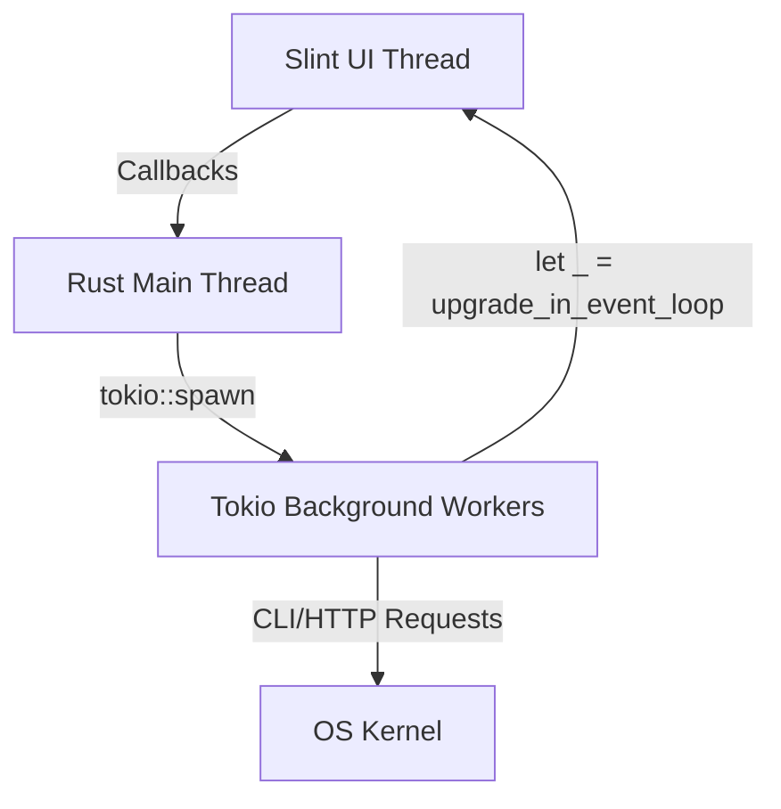

# WIWARP SYSTEM ARCHITECTURE (LLM-OPTIMIZED)

## 1. System Paradigm
- **Architecture**: Single-Process Native Linux Desktop App.
- **UI Toolkit**: Slint (Declarative, compiled to Rust at build-time).
- **Backend**: Rust + Tokio Async Runtime.
- **IPC Model**: Zero-network IPC via callbacks (UI -> Rust) and properties/VecModels (Rust -> UI).
- **UI Rendering**: GPU-accelerated native window (no WebView).

---

## 2. Component Map
- `build.rs`: Compiles `.slint` to Rust.
- `main.rs`: Allocates VecModels, links callbacks, spawns polling tasks, runs UI loop.
- `error.rs`: Custom error enum `AppError` built with `thiserror`.
- `helpers.rs`: Formatting (`speed`, `bytes`), logging (`append_log`), async tasks (`refresh_geoip`, `refresh_ping`).
- `callbacks.rs`: Registers and handles Slint interactive callbacks.
- `polling.rs`: Manages all asynchronous periodic polling loops.
- `wifi.rs`: Parses `nmcli` for wifi scans, connects with BSSID locks, extracts PSK keys, and parses `iw` link speeds.
- `warp.rs`: Manages `warp-cli` tunnel modes and handles wizard installation script in `/tmp` with safe permissions.
- `net_utils.rs`: Samples `/proc/net/dev` for speeds, runs async ping checks, queries `ip-api.com` geo data.
- `app.slint` & `ui/`: Modular UI panels and structures (`structs.slint`, `theme.slint`).

---

## 3. Data Flow & Threading Model
- **Thread-Safety constraint**: Main UI thread handles rendering. Heavy/CLI actions are offloaded via `tokio::spawn`.
- **UI Updates**: Async workers return state safely via `app_weak.upgrade_in_event_loop` using `let _ = ` to silently ignore event loop terminations when app exits.

---

## 4. Operational Engines

### 4.1 Multi-Interval Polling Loops (`polling.rs`)
- **500ms**: Animate radar step & pulse LED.
- **1s00**: Compute network RX/TX IO rates, plot SVG chart paths.
- **3s00**: Poll WiFi SSID and WARP tunnel status. Auto-trigger GeoIP update on state change.
- **5s00**: Probe Cloudflare (`1.1.1.1`) and Google (`8.8.8.8`) ping latencies.
- **Startup**: One-shot startup GeoIP sync after 1.5s delay.

### 4.2 Polkit RPM Daemon Installer
- Locates matching local terminal, spawns script `/tmp/install_warp_wizard_{PID}.sh` with owner-only `0o700` permissions. Bypasses GUI deps via `rpm -Uvh --nodeps`, uses shell `trap` for cleanup on EXIT.

---

## 5. Development Constraints
- **Lints**: Deny `unsafe_code`, `unwrap_used`, `expect_used`, `panic`. Warn `indexing_slicing`.
- **Zero Panic**: Bubble all failures as `Result<T, AppError>`. Render errors safely via `helpers::append_log`.
- **Shell Injection Prevention**: Hardcode command arguments arrays. SSIDs/Passwords processed strictly as dynamic arguments.
- **Language**: English for code & comments. Vietnamese for workspace chat & docs.

---

## 6. Slint-Rust Synchronization Map

### 6.1 Callbacks (UI ➔ Rust Events)
Linked in `src/callbacks.rs` inside `register_callbacks`:
- `close_modals()` ➔ Close modal overlays.
- `change_network_clicked()` ➔ Run background Wi-Fi frequency scan.
- `scan_range_clicked()` ➔ Force-refresh Wi-Fi scanner.
- `wifi_selected(ssid, bssid)` ➔ Load stored PSK keyring, lock BSSID profile.
- `connect_wifi_clicked(...)` ➔ Connect to network.
- `warp_toggle_clicked(bool)` ➔ Toggle WARP connection status.
- `warp_mode_clicked(string)` ➔ Set WARP tunnel mode (DNS or Dual).
- `install_rpm_clicked()` ➔ Spawn Polkit wizard installer.

### 6.2 State Properties (Rust ➔ UI Updates)
Updated via background loops in `src/polling.rs`:
- Loop 1 ➔ `pulse_led`, `radar_step`.
- Loop 2 ➔ `speed_stats`, `download_history`, `upload_history`, dynamic SVG chart paths.
- Loop 3 ➔ `active_wifi`, `warp_status_text`, `warp_status_color`, `warp_network_text`, `warp_toggle_state`.
- Loop 4 ➔ `ping1`, `ping2`.
- Loop 5 ➔ `geo_info` details.
