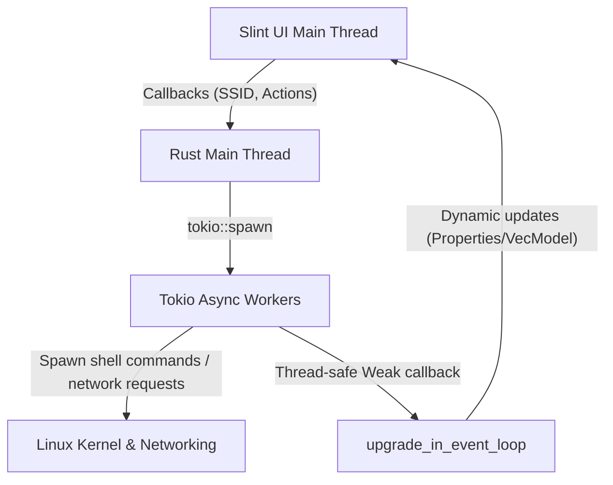

# WIWARP SYSTEM ARCHITECTURE (AGENT-OPTIMIZED)

This specification is optimized for LLM coding agents. It provides a dense, token-efficient system overview, file-level map, data flows, and critical programming constraints.

---

## 1. System Paradigm
- **Architecture**: Single-Process Native Linux Desktop App.
- **UI Toolkit**: Slint (Declarative UI, compiled to native Rust structures at build-time).
- **Backend**: Rust + Tokio Async Runtime.
- **IPC Model**: Zero-network IPC. Native memory sharing. Callbacks (UI $\rightarrow$ Rust) and properties/VecModels (Rust $\rightarrow$ UI).
- **UI Rendering**: GPU-accelerated native window (no Webview overhead).

---

## 2. Source Tree & Component Map

### 2.1 Backend Core (`src/*.rs`)
- `build.rs`: Compiles `.slint` markup to native Rust at compile time.
- `main.rs`: Application bootstrap. Hooks UI callbacks, initializes background tasks, manages application state.
- `wifi.rs`: Interfaces with `nmcli` and `iw`.
  - Wi-Fi scanning: parses `nmcli dev wifi list` terse output. Handles colon escaping.
  - Connection/BSSID lock: enforces BSSID connection via `nmcli dev wifi connect <BSSID>`. Modifies profile config `802-11-wireless.bssid <BSSID>` to prevent roaming.
  - Credential store: extracts stored WPA PSK via `nmcli -s -g 802-11-wireless-security.psk connection show <SSID>`.
  - Active link state: parses output of `iw dev <interface> link` for realtime TX bitrate.
- `warp.rs`: Interfaces with `warp-cli` and orchestrates Cloudflare WARP.
  - Mode management: switches daemon modes (`doh`, `warp`, `warp+doh`).
  - Wizard Installer: detects local terminal (e.g., `gnome-terminal`, `konsole`, `ptyxis`). Generates `/tmp/install_warp_wizard.sh` which downloads cloudflare-warp and runs `sudo rpm -Uvh --nodeps` (bypasses missing GUI dependencies like `webkit2gtk3`). Auto-deletes script/temp files on exit or interrupt using shell `trap`.
- `net_utils.rs`: Auxiliary networking metrics.
  - Realtime Speed: samples `/proc/net/dev` every second. Calculates Upload/Download delta rate.
  - Latency: concurrent single-packet pings to Google DNS (`8.8.8.8`) and Cloudflare DNS (`1.1.1.1`) with 1-second timeout.
  - Geolocation: Queries `http://ip-api.com/json/` via `curl`. Features a 3-retry fallback.

### 2.2 Frontend UI Layer (`src/ui/` & `src/app.slint`)
- `app.slint`: Main entry point. Declares layout grids, system console logs, toast alerts, modal dialogs, and coordinates sub-components.
- `ui/`:
  - `structs.slint`: Contains unified shared data structures used across Slint layers.
  - `header.slint`: Top brand bar, active system clock pulse LED indicator.
  - `diagnostics.slint`: Latency status, public IP geolocation coordinates, ISP detail rows.
  - `speed_monitor.slint`: Instantaneous bandwidth speedometers and historical rolling chart canvas.
  - `active_wifi.slint`: Active Wi-Fi details (BSSID, IP, Gateway, DNS) and Wi-Fi toggle switches.
  - `warp_control.slint`: Cloudflare WARP state controls, mode selectors, and quick installer trigger.
  - `modals.slint`: Wi-Fi scan results selector list, password entry prompt (with BSSID locking option).

---

## 3. Data Flow & Threading Model

UI updates must never block the main Slint GUI thread (must run at 60 FPS). Heavy CLI commands or API fetches are offloaded to Tokio workers.



### Thread-Safe UI Update Pattern
```rust
let app_weak = app.as_weak();
tokio::spawn(async move {
    let stats = fetch_stats().await;
    app_weak.upgrade_in_event_loop(move |app| {
        app.set_network_stats(stats);
    }).unwrap();
});
```

---

## 4. Operational Engines

### 4.1 Multi-Interval Polling Loop
Coordinated asynchronous polling triggers state updates back to Slint at different rates:
- **500ms**: Pulse LED heartbeat state, animate scan radar arcs.
- **1000ms**:
  - Sample network interface metrics (`/proc/net/dev` rx/tx bytes).
  - Probe active Wi-Fi and WARP daemon states (`nmcli` and `warp-cli status`).
  - Dispatch concurrent diagnostic pings to `1.1.1.1` and `8.8.8.8`.
- **30s (Geo-IP)**: Query public IP details.
  - **Bypass Trigger**: Instantly executed whenever a new Wi-Fi connection completes or WARP state is toggled.

### 4.2 Interactive Terminal Installer
1. Docks terminal list: `["gnome-terminal", "ptyxis", "konsole", "xfce4-terminal", "xterm"]`.
2. Locates first match. Spawns process using system arguments.
3. Target shell script `/tmp/install_warp_wizard.sh` sequence:
   ```bash
   trap 'rm -f /tmp/cloudflare-warp-*.rpm "$0"' EXIT INT TERM
   dnf download cloudflare-warp
   sudo rpm -Uvh --nodeps ./cloudflare-warp-*.rpm
   ```

---

## 5. Development Constraints & Guardrails

### 5.1 Strict Lint Rules (`Cargo.toml`)
```toml
[lints.rust]
unsafe_code = "deny"

[lints.clippy]
unwrap_used = "deny"
expect_used = "deny"
panic = "deny"
indexing_slicing = "warn"
```

### 5.2 Error Propagation
- **Zero Panic Policy**: No `unwrap`, `expect`, or direct `panic!` in the main codebase.
- **Standard Signature**: System routines must return `Result<T, String>`.
- **Failure UI integration**: Bubbled errors are caught in `main.rs` and dispatched to the UI console log panel (`app.global::<ConsoleLogger>().log(...)`) or displayed as Toast alerts.

### 5.3 Shell Injection Prevention
- UI never constructs shell command strings directly.
- Commands are hardcoded with strict arguments arrays in Rust using `std::process::Command` or `tokio::process::Command` (no raw shell parsing).
- User inputs (SSIDs, BSSIDs, passwords) are treated strictly as dynamic parameters.

### 5.4 Language Standards
- **Source Code**: English only for code, variables, functions, compiler parameters, and inline comments (`.rs`, `.slint`).
- **User Facing Docs / Workspace Chat**: Vietnamese.
